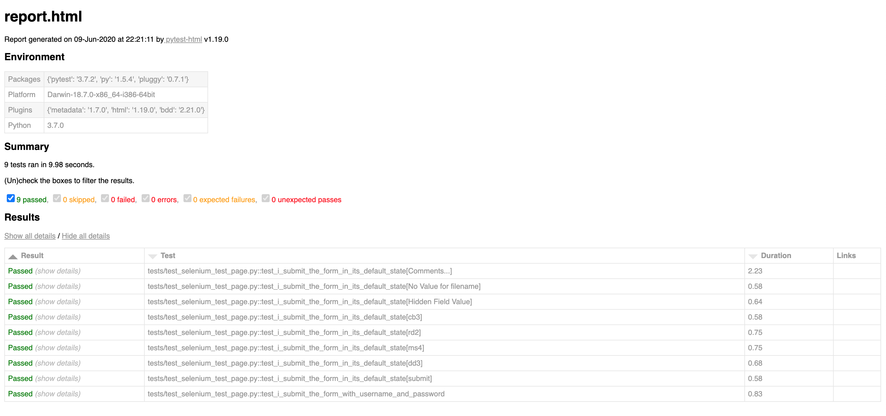

# automated_testing
An example of automated testing using the page object methodology.

If you'd like to use this framework then please give me a mention will ya (a lot of works gone into it!).
A requirements file is included for easier installation (e.g. pip install -r requirements.txt)

The framework currently supports the below browsers:

 - Chrome
 - Firefox
 - Safari
 
To run the tests all you need to do is include the browser option (e.g. --browser chrome or --browser firefox)
when running the tests.

Below is a screenshot of the results page thats produced after every test that can be loaded into a 
browser (just drag and drop it).

Screenshot of standard pytest command line results (Standard pytest result output).

This is a work in progress so I'll keep adding/removing stuff to/from the framework.